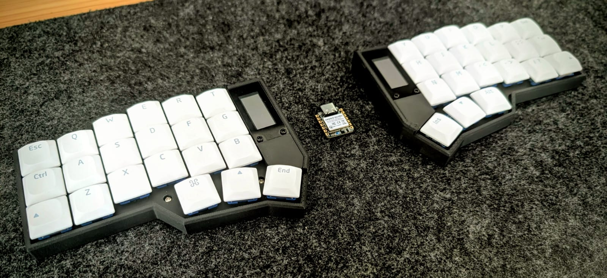
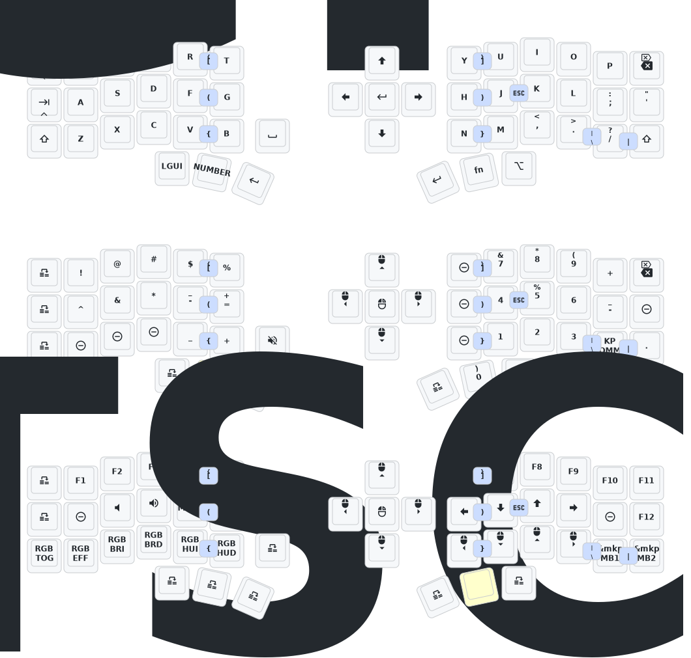

# ZMK Eyeslash Corne with XIAO BLE Dongle

**[English](#english) | [Deutsch](#deutsch)**
  
---

## English

This is my personal [zmk](https://githu.com/zmkfirmware/zmk) configuration for my
[eyeslash_corne](https://de.aliexpress.com/item/1005008551330418.html?spm=a2g0o.order_list.order_list_main.5.21ef5c5fdIQpG1&gatewayAdapt=glo2deu) keyboard. The firmware is developed for the following hardware:

- **Keyboard**: Eyeslash Corne
- **Dongle**: Seeed XIAO BLE nRF52840

> This is a dongle setup with ZMK studio support. The left and right keyboard both act as peripherals while the Seed XIAO functions as the main controller. This increases the battery life of the left keyboard compared to using it as both main and left peripheral. Furthermore you can unlock you your encrypted harddrive before boot.

#### Build Targets

For Dongle (XIAO):
- `xiao_eyeslash_dongle_oled.uf2` - With OLED display support
- `xiao_eyeslash_dongle.uf2` - Without OLED display
- `xiao_reset_settings.uf2` - Reset persistent settings

For Keyboard (Eyeslash Corne):
- `nano_eyeslash_left.uf2` - Left half
- `nano_eyeslash_right.uf2` - Right half
- `nano_reset_settings.uf2` - Reset persistent settings

 #### Installation

**Dongle Flashing (XIAO)**
1. Connect XIAO dongle to computer
2. Double-press small button for bootloader mode
3. Copy `xiao_reset_settings.uf2` (Optional, recommended for clean start)
4. After error appears, unplug and reconnect
5. Double-press button again for bootloader mode
6. Copy `xiao_eyeslash_dongle_oled.uf2` (or `xiao_eyeslash_dongle.uf2`)
7. After error appears, unplug

**Keyboard Flashing (Nice!nano)**
1. Connect left keyboard (don't turn on)
2. Double-press side button for bootloader mode
3. Copy `nano_reset_settings.uf2`
4. After error appears, unplug and reconnect
5. Double-press side button again
6. Copy `nano_eyeslash_left.uf2` (important: left firmware!)
7. Repeat steps 1-6 for right keyboard with `nano_eyeslash_right.uf2`

**Completion**
8. Connect XIAO dongle back to computer
9. Turn on both keyboard halves
10. Done!

#### Dependencies

- ZMK v0.3.0
- hammerbeam-slideshow (GPeye)
- prospector-zmk-module (tokyo2006)  
- zmk-dongle-display (englmaxi)
- nice-view-gem v0.3.0 (M165437)

#### Build

The project uses GitHub Actions for automated builds. The `.github/workflows/build.yml` file configures the build process for all defined targets.

> The `*_reset_settings.uf2` files are used to clear persistent settings like default layers, BLE pairings, and other saved data that may remain after repeatedly flashing new firmware.

---

## Deutsch
comming soon
